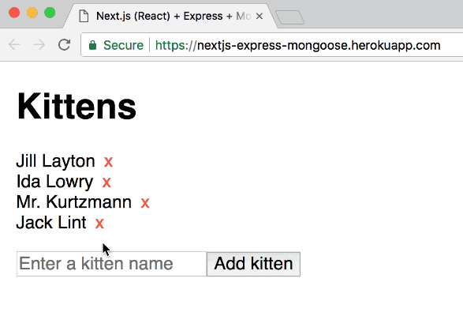

# Next.js client

This is the frontend client for our dapp. It is built with Next.js and uses a render-prop pattern (via `lib/Web3Container.js`) so we can easily inject blockchain functionality (i.e. web3, accounts, and the contract instance) into each page.

**Some commands** 
* `lsof -i:8545` => `kill -9 <process-id>`

## Pages

There are three pages:

- `index.js` — This is a barebones Next.js page. It links to other pages which are web3-enabled. In your dapp, this can be a landing page.
- `accounts.js` — This is a page listing the accounts returned from Web3. This file demonstrates the basic use of the `Web3Container` component.
- `dapp.js` — This is a barebones demonstration dapp that utilizes the `Web3Container` component, but also makes calls to the contract. More specifically, it stores a value and gets a value.

## The `lib` folder

### `contracts`

A symlink to the `build/contracts` located in the Truffle project is placed here so that the Next.js app can refer to the build artifacts from the parent Truffle project.

### `Web3Container.js`

This is a component that utilizes the render-prop pattern to inject `web3`, `accounts`, and `contract` instance objects into a given function. When these objects are loading, it will render a loading function that is expected to return a React component.

For an example of how to use it, please see the `accounts` and `dapp` pages.

You may want to modify this for your own purposes. For example, you can require multiple contracts if your dapp requires it.

### `getWeb3.js`

This is a function for actually getting the Web3 object. Unfortunately, this file is not as straight-forward as I would have liked it. Your best bet at understanding this is to read the comments I have written in the file. You probably don't need to change anything in this file.

### `getContract.js`

This function requires `web3` to be passed in. It uses `truffle-contract` to initialize and return a contract instance. This function is used by `Web3Container.js`. You probably don't need to change anything in this file.

### `getAccounts.js`

This simply wraps `web3.eth.getAccounts` into a Promise so we can use it cleanly inside `Web3Container.js`. You probably don't need to change anything in this file.

> Other boilerplate

# Next.js (React) + Redux + Express REST API + MongoDB + Mongoose-Crudify boilerplate

Based on [nextjs-express-boilerplate](https://github.com/johhansantana/nextjs-express-boilerplate), but with added [mongoose-crudify](https://github.com/ryo718/mongoose-crudify) and [redux-api](https://github.com/lexich/redux-api).

**NOTE:** this project now uses Redux and [redux-api](https://github.com/lexich/redux-api). See the [no-redux](https://github.com/tomsoderlund/nextjs-express-mongoose-crudify-boilerplate/tree/no-redux) branch for the (unmaintained) version without Redux.

## Why is this awesome?

This is a great starting point for a any project where you want **React + Redux** (with server-side rendering, powered by [Next.js](https://github.com/zeit/next.js)) as frontend and **Express/MongoDB** as a REST API backend.
Lightning fast, all JavaScript.

## Demo

See [**nextjs-express-mongoose-crudify-boilerplate** running on Heroku here](https://nextjs-express-mongoose.herokuapp.com/).

## How to use

Clone this repository:

	git clone https://github.com/tomsoderlund/nextjs-express-mongoose-crudify-boilerplate.git [MY_APP]

Install dependencies:

	cd [MY_APP]
	yarn  # or npm install

Start it by doing the following:

	export MONGODB_URI=*your mongodb url* // you can get one for free at https://www.mlab.com/home
	npm run dev

In production:

	npm run build
	npm start

If you navigate to `http://localhost:3001/` you will see a [Next.js](https://github.com/zeit/next.js) page with a list of kittens (or an empty list if you haven't added one).

You have your API server running at `http://localhost:3001/api/kittens`

## Deploying

### Deploying on Heroku

	heroku create [MY_APP]
	heroku addons:add mongolab
	git push heroku master

### Deploying on Now

See instructions on [nextjs-express-boilerplate](https://github.com/johhansantana/nextjs-express-boilerplate).
